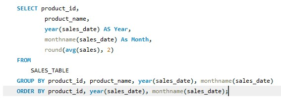

# SQL-Chilly-Analysis-

## Introduction 
This session is for Data Exploration using MySQL workbench. We a considering a schema called Chillydata.
###### **_Disclaimer_**: All dataset and reporrt does not repreent any company, institution or country, just a dumy dataset. 

## Problem statement 
-	Year / Month Sales Trends Visualization		
- Region Sales Totals by Year and % Change		
-	Average Month Sales by Product	
-	products with the highest profit 
-	Year by Supplier Sales

## Data Schema 

### Tables, Columns and Data types 

## Data exploration
Observing the questions to be solve above, it will be good to create a temporary table that contains all information needed to answer those questions just in a table. Values likely to be needed are the Sales_date,Region, product_name, Sales_rep name, Sales(Price * Unit), Profit (price – cost).
#### Syntax:

#### Temporary table (SALES_TABLE) View 

## Task 1: Year / Month Sales Trends Visualization

**Syntax**                          |        **Result**
:----------------------------------:|:-------------------------------:                              
                      |      

The above query generates the table used to create a visual chart using tools such as Tableau, excel… for visualization.

### Visual 

There as been a trend of increment in sales in Auqust, November and partly December and a decline in the first quater. 

## Task 2: Region Sales Totals by Year and % Change

**Syntax**                                                           
 

**Result**

Obvious that the sales growth from each region isn’t consistent. For CA region there was an increase in the first two years (2021 & 2022) but a decrease of -6.75% to the previous year in 2023 and for WA there was a decrease of -58.12% in the year 2022 and a pick-up increase in 2023 but revenue wasn’t up to that of 2021.

## Task 3:  Average Month Sales by Product	
**Syntax**                          |        **Result**
:----------------------------------:|:-------------------------------:                              
                     |      

Above snapshot shows the syntax that result Average sales by product and will be better interpreted using visual tools. 
                              

## Task 4:  products with the highest profit 
**Syntax**                          |        **Result**
:----------------------------------:|:-------------------------------:                              
                      |      

Eraser with product_id ‘2’ is the most sold product
 
## Task 5:  Year by Supplier Sales
**Syntax**                          |        **Result**
:----------------------------------:|:-------------------------------:                              
                      |      

#### Visual 

Chally with Salesrep_id '2' seams to be the leading sales_rep while salesrep with id '3' as an extreemly low sales and need to improve greatly.
For a better insight, we need to be sure that location (region) does not have an influence on sales rep performance. 

**Syntax**                          |        **Result**
:----------------------------------:|:-------------------------------:                              
                       |      

From the result above sales rep region does not have an influence on their performance, as we could see that the first two leading sales Rep are from a different region. 

## Sales Summary 
**Syntax**                          |        **Result**
:----------------------------------:|:-------------------------------:                              
                        |      

Total sales **_$199,770.00_**, Total profit **_$103,506.00_**, No_of_Transaction **_91_**. 

## Conclusion and Recommendation 
Across All years the company made profits but the profit made are not consistent. Also some Sale Rep are not very effective likewise item with product_id '3' has a very low sales. 

Sales Rep should be Trained or changed and their location swap should be considered. 
